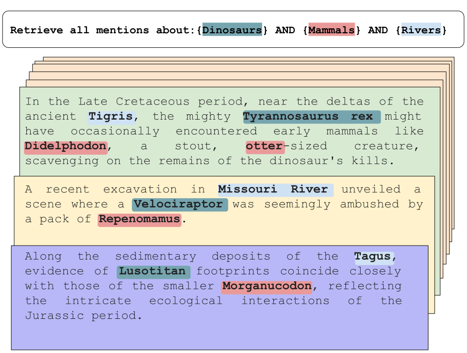

# NERetrieve: Dataset for Next Generation Named Entity Recognition and Retrieval


This is the original code and dataset of the NERretrieve paper:  [**NERetrieve: Dataset for Next Generation Named Entity Recognition and Retrieval**](https://arxiv.org/abs/2310.14282).




\*\*\*\*\*\*\*\*\*\*\*\*\*\*\*\*\*\*\*\*\*\*\*\*\*\*\*\*\*\*\*\*\*\*\*\*\*\*\*\*\*\*\*\*\*\*\*\*\*\* **Updates** \*\*\*\*\*\*\*\*\*\*\*\*\*\*\*\*\*\*\*\*\*\*\*\*\*\*\*\*\*\*\*\*\*\*\*\*\*\*\*\*\*\*\*\*\*\*\*\*\*\*

- 03/12/2023: 🎉🎉🎉 NERetrieve paper was accepted to **Findings of EMNLP 2023** and will be presented during the BlackboxNLP 2023
 poster session.🎉🎉🎉 

## NERetrieve Dataset

NERetrieve dataset is available in three distinct formats, catering to various use cases and research requirements:

1. [**Exhaustive Typed-Entity Mention Retrieval**](/Retrieval/IR_readme.md)

2. [**Fine-grained Supervised NER**](/supervised_NER/sup_readme.md)

3. **Zero-shot Fine-grained NER**

For detailed information including data specifics, code, and results, please refer to the dedicated pages.


## Citation
Please Cite our work using:

```bibtex
@inproceedings{katz-etal-2023-neretrieve,
    title = "{NER}etrieve: Dataset for Next Generation Named Entity Recognition and Retrieval",
    author = "Katz, Uri  and
      Vetzler, Matan  and
      Cohen, Amir  and
      Goldberg, Yoav",
    editor = "Bouamor, Houda  and
      Pino, Juan  and
      Bali, Kalika",
    booktitle = "Findings of the Association for Computational Linguistics: EMNLP 2023",
    month = dec,
    year = "2023",
    address = "Singapore",
    publisher = "Association for Computational Linguistics",
    url = "https://aclanthology.org/2023.findings-emnlp.218",
    pages = "3340--3354",
}
```

## License
The NERetrieve dataset is distributed under the CC BY-SA 4.0 license.

## Connection
Feel free to connect with us on any issue, suggestions or just a friendly conversation. 

[urikacid@gmail.com](mailto:urikacid@gmail.com)
