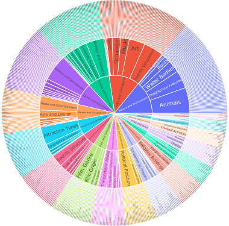

# NERetrieve: Dataset for Next Generation Named Entity Recognition and Retrieval

This is the source code of the NERretrieve paper:  [**NERetrieve: Dataset for Next Generation Named Entity Recognition and Retrieval**]([https://arxiv.org/abs/2105.07464](https://arxiv.org/abs/2310.14282)).

  

  

\*\*\*\*\*\*\*\*\*\*\*\*\*\*\*\*\*\*\*\*\*\*\*\*\*\*\*\*\*\*\*\*\*\*\*\*\*\*\*\*\*\*\*\*\*\*\*\*\*\* **Updates** \*\*\*\*\*\*\*\*\*\*\*\*\*\*\*\*\*\*\*\*\*\*\*\*\*\*\*\*\*\*\*\*\*\*\*\*\*\*\*\*\*\*\*\*\*\*\*\*\*\*

- 03/12/2023: 🎉🎉🎉 NERetrieve paper was accepted to **Findings of EMNLP 2023** and will be presented during the BlackboxNLP 2023
 poster session.🎉🎉🎉 

## NERetrieve Dataset

NERetrieve dataset is available in three distinct formats, catering to various use cases and research requirements:

1. **Exhaustive Typed-Entity Mention Retrieval**

2. **Fine-grained Supervised NER**: 

3. **Zero-shot Fine-grained NER**

For detailed information including data specifics, code, and results, please refer to the dedicated pages.
